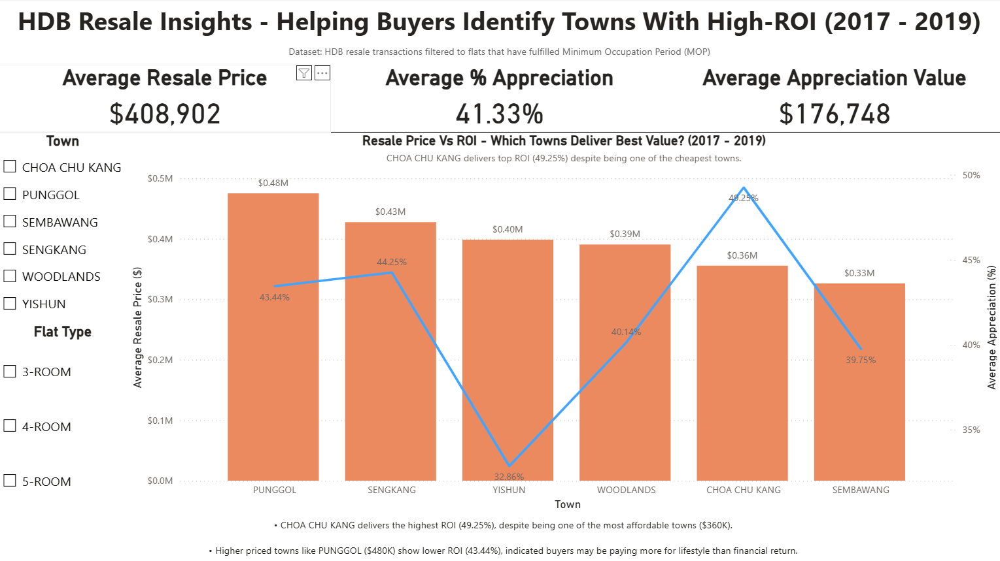

# HDB_Resale_Analysis (Singapore)

This project analyzes the trends of **HDB resale flat prices based on registration date from Jan 2017 onwards** using data from [Data.gov.sg](https://data.gov.sg/datasets/d_8b84c4ee58e3cfc0ece0d773c8ca6abc/view).  
The goal is to uncover insights about pricing patterns across towns, flat types, and lease years, and present findings through **Python, SQL, and Power BI**.

Objectives
- Clean and prepare resale flat transaction data for analysis.
- Perform exploratory data analysis (EDA) to identify trends and correlations.
- Build SQL queries to answer business questions.
- Create an interactive Power BI dashboard for visualization.
- Summarize findings and provide insights for stakeholders.

Key Analysis (Python)
1. Transaction Counts
- Identified towns with the most and least transactions per flat type
- Example: 4-ROOM flats had the most transactions in Sengkang Town(2019 and 2022)

2. Resale Price
- Compared towns with the highest and lowest resale prices
- Example: For 4-ROOM and 5-ROOM flats, Central Area led in high resale prices, while non-Central(Woodlands, Sembawang, Yishun and Jurong West) stayed at the lower end

3. Remaming Lease(>=95 years)
- Focused on the resale price of flat types that sell immediately after the MOP (Minimum Occupation Period)
- Central Area(Bukit Merah and Queenstown) topped in prices, while Sembawang, Woodlands & Choa Chu Kang were the lowest

## Power BI Dashboard — HDB Resale Insights (ROI Analysis)

Live Dashboard (Interactive)
- https://app.powerbi.com/view?r=eyJrIjoiZGVmYmIzODMtZDVjMi00Mjc4LTg1ZjQtODhkM2FjZWU3MGY4IiwidCI6IjU1OTE4ODE4LWIyZjUtNGFmMS1hZTA3LTFhMDFkYmM1YjFhNCIsImMiOjEwfQ%3D%3D  

---

Objective
To help HDB buyers identify which towns deliver the highest financial return by comparing **Average Resale Price vs Average % Appreciation  (2017–2019)**, focused on flats that fulfilled 
the **Minimum Occupation Period (MOP)**. Users can filter the dashboard by **flat type (3-room, 4-room, 5-room)** to compare ROI across different segments of the market.

This dashboard showcases my ability in:
- Data modelling & DAX
- Visual storytelling using KPIs, slicers & combo-charts
- Transforming SQL output → actionable insights

---

### Key Insights From the Dashboard
| Insight | Meaning |
|--------|---------|
| **CHOA CHU KANG has the highest ROI (49.25%)** despite being one of the cheapest towns ($360K) | For value-driven buyers, ROI > prestige, CCK delivers gains at low entry cost |
| **PUNGGOL has one of the highest resale prices ($480K) but lower ROI (43.44%)** | Buyers may be paying more for lifestyle than financial upside |

---

### Visual Features Included
-  KPI cards – Average Price, Average % Appreciation , Average Appreciation Value
-  Combo chart – price vs ROI for each town
-  Interactive slicers – Town & Flat Type (3-/4-/5-room) to filter insights dynamically
-  Insight text panel — summarizing ROI findings for clarity

---

###  Dashboard Preview

Click the [link](https://app.powerbi.com/view?r=eyJrIjoiZGVmYmIzODMtZDVjMi00Mjc4LTg1ZjQtODhkM2FjZWU3MGY4IiwidCI6IjU1OTE4ODE4LWIyZjUtNGFmMS1hZTA3LTFhMDFkYmM1YjFhNCIsImMiOjEwfQ%3D%3D  ) to explore the interactive version of this dashboard.
