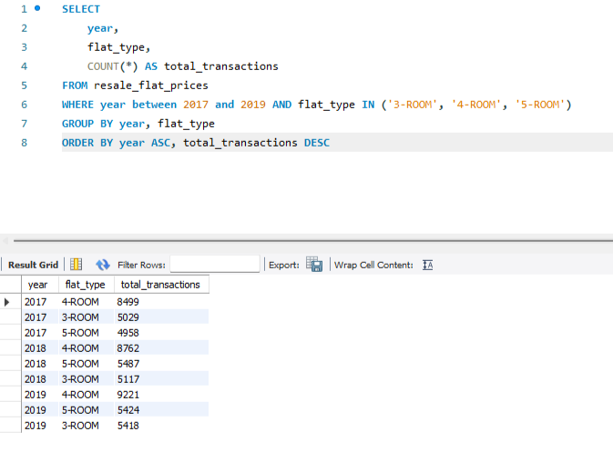

# SQL Analysis 1: HDB Transaction Count by Flat Type (2017–2019)

## Objective
To identify which **HDB flat type** (3-ROOM, 4-ROOM, or 5-ROOM) had the **highest number of resale transactions** between **2017 to 2019**, using SQL.

---

## Business Question
> “Which flat type among 3-ROOM, 4-ROOM, and 5-ROOM had the most resale transactions from 2017 to 2019?”

Understanding the popularity of different flat types can help inform public housing policies, pricing strategies, and development planning.

---

## Dataset
- **Source**: [Data.gov.sg – HDB Resale Flat Prices](https://data.gov.sg/dataset/resale-flat-prices)
- **Data Columns Used**: 
  - `flat_type`
  - `year`
- **Filtered Years**: 2017, 2018, 2019
- **Filtered Flat Types**: 3-ROOM, 4-ROOM, 5-ROOM

---

## SQL Query

```sql
SELECT 
    year,
    flat_type,
    COUNT(*) AS total_transactions

FROM resale_flat_prices

WHERE year BETWEEN 2017 AND 2019
  AND flat_type IN ('3-ROOM', '4-ROOM', '5-ROOM')

GROUP BY year, flat_type

ORDER BY year ASC, total_transactions DESC;

```
---

## Query and Output Screenshot


---

## Findings
- **4-ROOM** flats had the highest number of resale transactions from **2017 to 2019**.
- **3-ROOM** flats consistenly had fewer transactions compared to 4-ROOM and 5-ROOM flats.
- This trend was stable across all three years,  showing that the 4-ROOM flats had the strong demand on the resale market which likely due to the balance of size and affordability.
