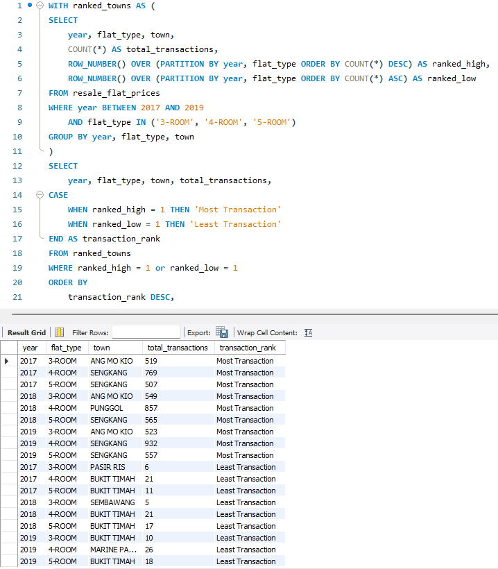

# SQL Analysis 2: Town with Most and Least Resale Transactions by Flat Type (2017–2019)

## Objective

Identify **which town had the most and least number of resale HDB flat transactions** for each flat type (`3-ROOM`, `4-ROOM`, `5-ROOM`) from **2017 to 2019**. This helps in understanding geographical transaction patterns for different flat sizes.

---
## Business Question
>"Which town had the highest and lowest resale transactions volume for each flat type (3-ROOM, 4-ROOM and 5-ROOM) from 2017 to 2019?"

Appreciating where demand or scarcity exists can help stakeholders understand geopraphic trends in Singapore's HDB resale market.

---
## Dataset
- **Source**: HDB Resale Flat Prices — Data.gov.sg  
- **Data Columns Used**:  
  - `year` (transaction year)  
  - `flat_type` (3‑ROOM, 4‑ROOM, 5‑ROOM)  
  - `town`  
- **Filters Applied**:  
  - Years: 2017, 2018, 2019  
  - Flat Types: 3‑ROOM, 4‑ROOM, 5‑ROOM  

---

## SQL Query

```sql
WITH ranked_towns AS (
SELECT
	year, flat_type, town,
    COUNT(*) AS total_transactions,
	ROW_NUMBER() OVER (PARTITION BY year, flat_type ORDER BY COUNT(*) DESC) AS ranked_high,
  ROW_NUMBER() OVER (PARTITION BY year, flat_type ORDER BY COUNT(*) ASC) AS ranked_low

FROM resale_flat_prices

WHERE year BETWEEN 2017 AND 2019
	AND flat_type IN ('3-ROOM', '4-ROOM', '5-ROOM')

GROUP BY year, flat_type, town
)

SELECT
	year, flat_type, town, total_transactions,
CASE
	WHEN ranked_high = 1 THEN 'Most Transaction'
    WHEN ranked_low = 1 THEN 'Least Transaction'
END AS transaction_rank

FROM ranked_towns

WHERE ranked_high = 1 or ranked_low = 1

ORDER BY
	transaction_rank DESC,
    year,
    flat_type
```
---

## Query and Output Screenshot


---

## Findings
- **Sengkang** remained a key hotspot with the **highest transaction** volumes for larger flat types (4-ROOM and 5-ROOM) across all three years.
- **Bukit Timah** consistently showed up as the **lowest transaction** volumes across all flat types and year, perhaps reflecting it's unique housing distribution.
- **Ang Mo Kio** leads in 3-ROOM flat type transactions, while **Pasir Ris, Sembawang and Bukit Timah** lag behind. This showcasing macro demand dynamics in different locations.
- **Sengkang** `town` is a highly preferred residential area, especially for families or upgraders seeking spacious living. 
