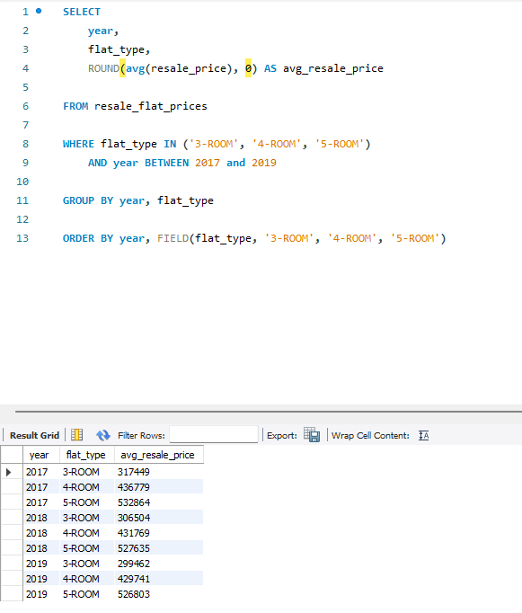

# SQL Analysis 3: Average Resale Price By Flat Type (2017 - 2019)

---

## Objectives
To analyze the **average resale price** of HDB flat types (3-ROOM, 4-ROOM and 5-ROOM) from 2017 to 2019. This helps us undestand how flat prices have changed over time and whether certain flat types appreciate faster than others.

---

## Business Question
>"What is the **average resale price** for 3-ROOM, 4-ROOM and 5-ROOM flats from **2017 to 2019**?

Find out the average resale price of the different flat types on the HDB resale market.

---

## Dataset
- **Source**: [Data.gov.sg – HDB Resale Flat Prices](https://data.gov.sg/dataset/resale-flat-prices)
- **Data Columns Used**: 
  - `flat_type`
  - `resale_price`
  - `year`
- **Filtered Years**: 2017, 2018, 2019
- **Filtered Flat Types**: 3-ROOM, 4-ROOM, 5-ROOM

---

## SQL Query

``` sql
SELECT
	year,
    flat_type,
    ROUND(avg(resale_price), 0) AS avg_resale_price
    
FROM resale_flat_prices

WHERE flat_type IN ('3-ROOM', '4-ROOM', '5-ROOM')
	AND year BETWEEN 2017 and 2019
    
GROUP BY year, flat_type

ORDER BY year, FIELD(flat_type, '3-ROOM', '4-ROOM', '5-ROOM')

```

*The query uses SQL’s `AVG()` function to calculate average resale prices, and `ROUND()` to remove decimal places for cleaner presentation.*


---

## Query and Output Screenshot


---

## Findings
- From year 2017 to 2019, average resale prices of all the flat types (3-ROOM, 4-ROOM and 5-ROOM) shows declined, regardless of the size. The trends shows that the resale market on year 2017 to 2019 were having the downward trend on the resale price
- In 2017, **3-ROOM** flats averaged resale price was $317,449 but by 2019, the resale price had dropped to $299,462, which was falling below the $300,000 mark. This represents a 5.7% decrease over 3 years, the steepest drop among all the flat types.
- Average resale price of **4-ROOM** flats fell but stayed above $420,000. Average resale price dipped from $436,779 (2017) to $429,741 (2019), which was a 1.6% decrease. Despite the decline, **4-ROOM** flats remained relatively stable compared to other flat types.
- **5-ROOM** flats showed a mid-level decline. The average resale price dropped from $532,864 (2017) to $526,803 (2019), a 1.1% drop. This shows that **5-ROOM** flats had a better value-retaining compared to **3-ROOM** and **4-ROOM** flats.
