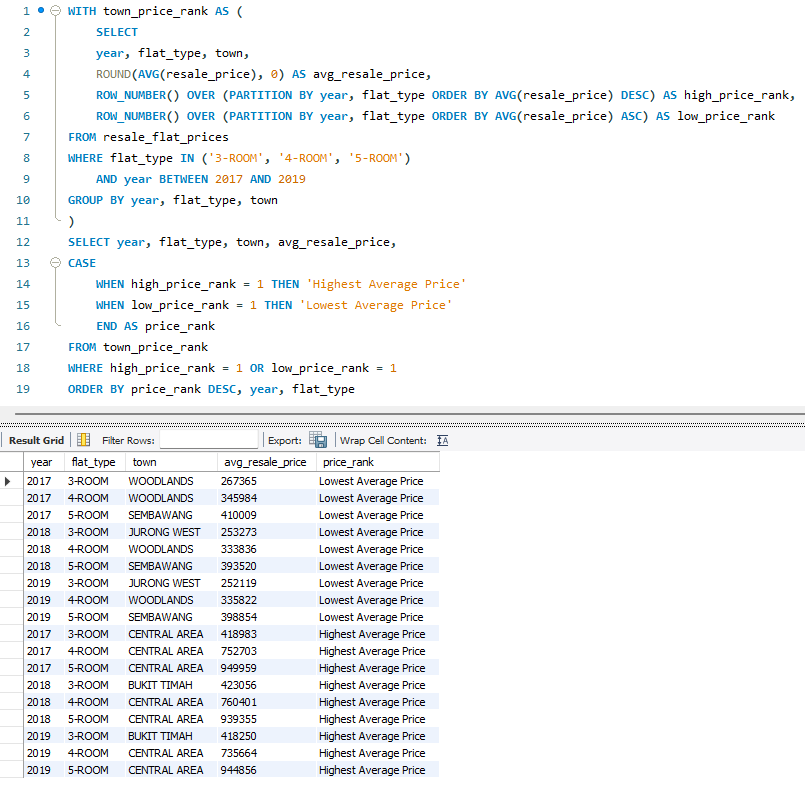

# SQL Analysis 4: Town With Highest and Lowest Average Resale Price By Flat Type (2017 - 2019)

---

## Objective
The goal of this analysis is to identify the towns that recorded the **highest** and **lowest** average resale price for 3-ROOM, 4-ROOM and 5-ROOM flats across the years of **2017 to 2019**. This helps uncover **price disparity trends** across different towns, providing valuable insight into affordability and demand zones within Singpapore's public housing market.

---

## Dataset Used
- **Source**: [Data.gov.sg – HDB Resale Flat Prices](https://data.gov.sg/dataset/resale-flat-prices)
- **Table:** `resale_flat_prices`
- **Data Columns Used**:  
  - `year` (transaction year)  
  - `flat_type` (3‑ROOM, 4‑ROOM, 5‑ROOM)  
  - `town`
  - `resale_price`

---

## SQL Functions Used
- `AVG()`: Calculates the average resale price grouped by year, flat type, and town.
- `ROUND()`: Rounds the average resale price to the nearest dollar for clean output.
- `ROW_NUMBER() OVER (PARTITION BY ...)`: Ranks towns based on their average price for each year and flat type, used to isolate the top and bottom performer.

---

## SQL Query

```sql
WITH town_price_rank AS (
	SELECT
    year, flat_type, town,
    ROUND(AVG(resale_price), 0) AS avg_resale_price,
    ROW_NUMBER() OVER (PARTITION BY year, flat_type ORDER BY AVG(resale_price) DESC) AS high_price_rank,
    ROW_NUMBER() OVER (PARTITION BY year, flat_type ORDER BY AVG(resale_price) ASC) AS low_price_rank

FROM resale_flat_prices

WHERE flat_type IN ('3-ROOM', '4-ROOM', '5-ROOM')
	AND year BETWEEN 2017 AND 2019

GROUP BY year, flat_type, town
)

SELECT year, flat_type, town, avg_resale_price,
CASE
	WHEN high_price_rank = 1 THEN 'Highest Average Price'
    WHEN low_price_rank = 1 THEN 'Lowest Average Price'
	END AS price_rank

FROM town_price_rank

WHERE high_price_rank = 1 OR low_price_rank = 1

ORDER BY price_rank DESC, year, flat_type

```

---

## Query and Output Screenshot


---

## Findings
- **Central Area** and **Bukit Timah** has the **highest average resale prices** across all the flat types from year 2017 to 2019. A **5-ROOM** flat in **Central Area** is having the average resale price of $944,856 on year 2019, which almost hitting the $1,000,000 mark on the Singapore's public housing market.
- On the opposite end, **Woodlands**, **Sembawang** and **Jurong West** repeatedly appear with the **lowest average resale prices** as low as $252,119 for **3-ROOM** flat in **Jurong West** on year 2019.
- This contrast shows a clear premium pricing trend in central regions, while peripheral towns maintain affordability.
 


