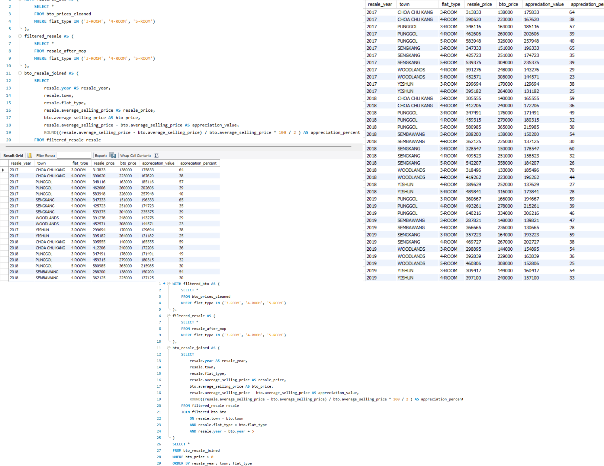

# SQL Analysis 5: HDB BTO Price Appreciation After Minimum Occupation Period (MOP) By Flat Type (2017 - 2019)

---

## Objective
This analysis aims to evaluate the **value apprecation of BTO flats** by comparing their **average launch prices** against their resale prices after the 5-year Minimum Occupation Period (MOP). We want to understand better on how much BTO owners potentially gain after fulfilling MOP and are eligible to sell their flats.

---

## Dataset
- **Source**: [Data.gov.sg – HDB Resale Flat Prices](https://data.gov.sg/dataset/resale-flat-prices) | [Data.gov.sg - Price Range of HDB Flats Offered](https://data.gov.sg/datasets/d_2d493bdcc1d9a44828b6e71cb095b88d/view)
- **Data Columns Used**:
  - `bto_prices_cleaned`: Contains the average selling prices of BTO flats across various towns and years (cleaned version of the raw BTO csv)
  - `resale_after_mop`: Contains resale prices of flats from the HDB resale dataset, filtered for flats that have passed MOP (based on lease year logic)
- **Filtered Flat_Types**:
  - `3-ROOM`, `4-ROOM`, `5-ROOM`
- **Filtered Remaining Lease Year**:
  - `= 95`

---

## SQL Query 
**1. Filtering for Relevant Flat Types**
- We are focused only on flat types:
    - `3-ROOM`
    - `4-ROOM`
    - `5-ROOM`

 ``` sql
WITH filtered_bto AS (
	SELECT *
    FROM bto_prices_cleaned
    WHERE flat_type IN ('3-ROOM', '4-ROOM', '5-ROOM')
),

filtered_resale AS (
	SELECT *
    FROM resale_after_mop
    WHERE flat_type IN ('3-ROOM', '4-ROOM', '5-ROOM')
),
```

**2. Calculating Appreciation After 5 Years (MOP)**
- Using a **JOIN** between filtered BTO and resale datasets, we matched entries by:
  - **Same town**
  - **Same flat type**
  - **Resale year = BTO Year + 5 (after the MOP period)**
- We then computed:
  - `appreciation_value`: Difference between resale and BTO price
  - `appreciation_percent`: Percent increase, averaged over 5 years
 
``` sql
bto_resale_joined AS (
	SELECT
		resale.year AS resale_year,
        resale.town,
        resale.flat_type,
        resale.average_selling_price AS resale_price,
        bto.average_selling_price AS bto_price,
        resale.average_selling_price - bto.average_selling_price AS appreciation_value,
        ROUND((resale.average_selling_price - bto.average_selling_price) / bto.average_selling_price * 100 / 2 ) AS appreciation_percent

	FROM filtered_resale resale

  JOIN filtered_bto bto
		ON resale.town = bto.town
        AND resale.flat_type = bto.flat_type
        AND resale.year = bto.year + 5
)

```

**3. Excluding Abnormal Data**
- To maintain accuracy, we excluded rows with **appreciation_value = 0**, as they may skew the average or indicate:
  - **Incomplete data**
  - **Invalid matches**
  - **Market anomalies**

 ``` sql
SELECT *

FROM bto_resale_joined

WHERE bto_price > 0

ORDER BY resale_year, town, flat_type

```

---

## Query and Output Screenshot


---

## Findings
- The analysis shows that HDB flats generally **appreciate in value after the 5-year Minimum Occupation Period (MOP)**, with some towns (e.g., Punggol, Sengkang, Yishun) and flat types (4-room, 5-room) showing stronger appreciation than others.
- This **capital appreciation** trend is a strong indication that HDB flats can act as a hedge against inflation, helping homeowners preserve (and grow) the real value of their asset over time.
- The appreciation is not necessarily “profit” in an investment sense, but rather reflects:
  - Demand for public housing in maturing towns
  - Upgrading of neighborhoods (eg. new MRT lines, schools, malls)
  - Overall inflation and cost of construction over time
- The analysis also suggests that **location** and **flat type** play key roles in appreciation — with larger flats in up-and-coming towns showing higher price growth after MOP.
